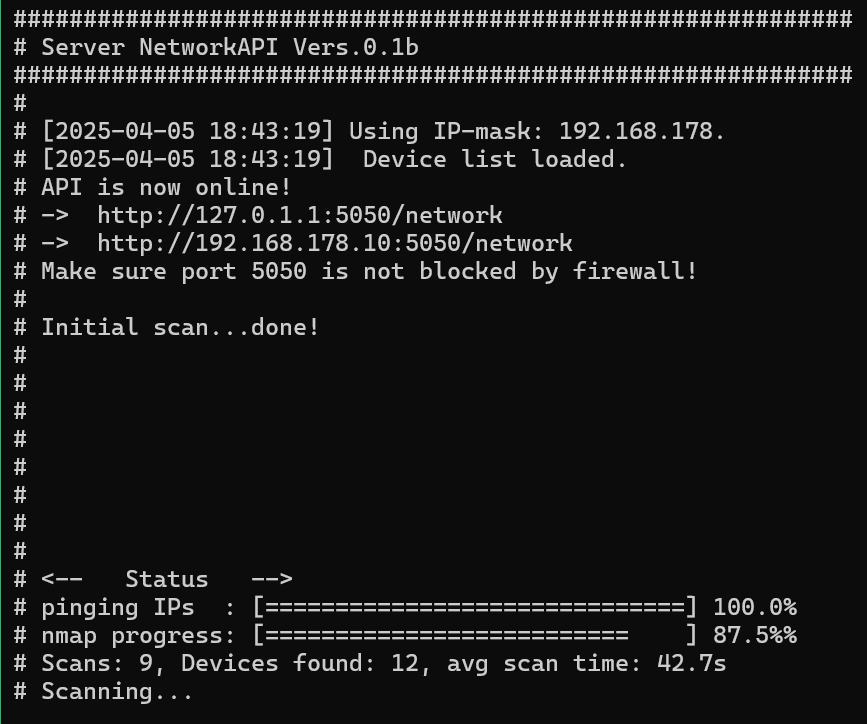
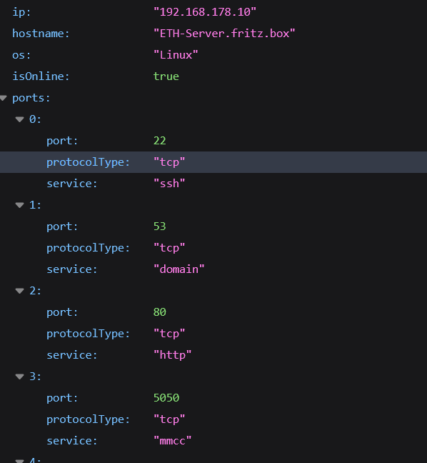
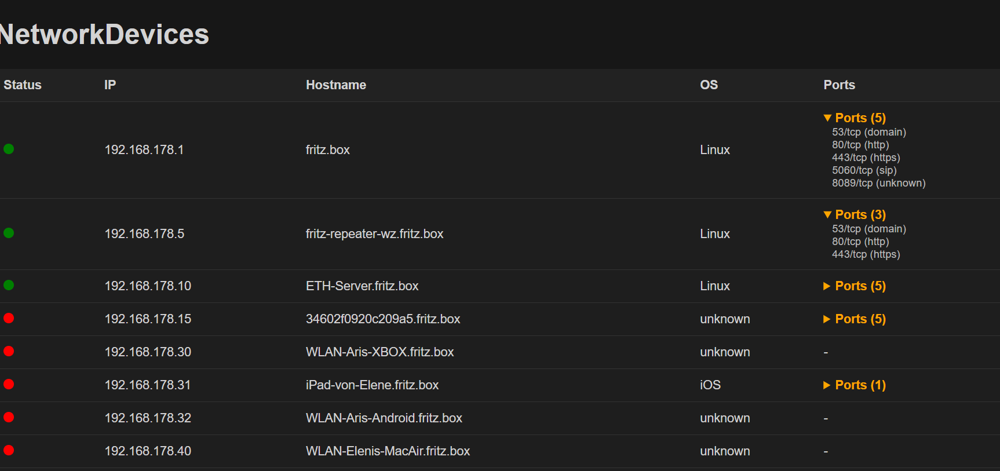
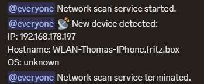

# ServerNetworkAPI (v0.2.2b)

A minimalistic Web API that scans your local IPv4 network and provides information like IP, OS, and open ports of all reachable devices.

Built with **.NET 9.0**

---
## Why This Tool Exists

Since I´m learning programming C#, Linux handling and networking, I wanted to create a simple tool that helps me understand how devices communicate on a local network.
I also wanted to learn how to create a **Web API** and how to use **webhooks** for notifications.

So I developed this tool to monitor all active devices in my **private network**, specifically on a **headless Linux server**. 
I wanted an always-on **local Web API** that gives me live access to all devices on the network – including:

- IP addresses
- Hostnames
- OS guesses
- Open ports

In my setup, my DHCP server assigns IPs **from `192.168.178.190` upwards** to any **new/unregistered device**.

Whenever this tool detects a new IP in that range, 
it sends me a **webhook notification** (e.g. to Discord), allowing me to check immediately:

- Is this a device I expect?
- Or is someone unauthorized on my network?

This lightweight scanner gives me **peace of mind** and an easy way to monitor
who joins my WiFi or wired LAN – from any device via the built-in Web API or push alert.

I know this isn't a perfect security solution — but it’s definitely better than nothing :D
And for me, it’s a great learning project to grow my understanding of networks, APIs, and server monitoring.

---

## Current Features

- Automatic local network scan using `arp-scan`
- Optional detailed device scan via `nmap`
- Basic OS recognition (not working as intended yet)
- CLI argument support
- RESTful Web API (JSON output)
- HTML frontend template for API values (optional)
- Persistent device data between restarts
- Color-coded terminal output
- Offline detection & live status
- Logfile creation
- Statically assigned IP detection (highlighted)
- **Webhook notifications** for new devices and service status changes (started/terminated)
- **External Config Files**:
  - `NotificationConfig.json` for webhooks
  - `AppConfig.json` for persistent settings (overridable by CLI)

## Upcoming Features

- Mac address recognition
- Device type recognition (e.g. phone, computer, etc.)
- Improved OS recognition
- propper WebUI as a seperate project
- More detailed `nmap` scan options
- better error handling
- more robust code
- and some other stuff...

---

## Preview

### Terminal Output (Linux)


### Web Output (Raw JSON)


### Web Output (HTML Frontend)


### Discord Webhook (Notifications)


---

## How It Works

The app continuously scans your local network (e.g. `192.168.x.x`) via ARP ping to find active devices.  
For each active IP, it performs (optional) detailed scans via `nmap` to retrieve:

- Open ports & services
- OS fingerprint (basic)
- Hostname

Devices are tracked persistently – even offline devices remain in the list (marked as offline).  
If the last octet of a device IP exceeds a defined threshold, it's flagged as *non-DHCP* (e.g. static/manual).

---

## Requirements

- root or sudo privileges (for `arp-scan` and `nmap` commands)
- Linux x64 system

### Dependencies:

use: 
- [Dependencies installer] (./setup_dependencies.sh)
- ```chmod +x setup-dependencies.sh```
- ```./setup-dependencies.sh```

or manual:
- [.NET 9.0 Runtime](https://dotnet.microsoft.com/en-us/download/dotnet/9.0) (only if building yourself)
- [.NET NuGet]```dotnet add package Microsoft.Extensions.Hosting``` (only if building yourself)
- [.NET NuGet]```dotnet add package Microsoft.AspNetCore.Mvc.Core``` (only if building yourself)
- [`nmap`](https://nmap.org/) (optional but recommended)
- [`arp-scan`](https://linux.die.net/man/1/arp-scan) – must be installed (`sudo apt install arp-scan`)

---

## How to Run

Download the [latest Linux build](https://github.com/DRgreenT/ServerNetworkAPI/blob/main/publish/linux.zip), then:

```bash
chmod +x ServerNetworkAPI
./ServerNetworkAPI
```

To run the program, `nmap` and `arp-scan` must be installed:

```bash
sudo apt install nmap arp-scan     # Debian, Ubuntu, Raspberry Pi OS
sudo pacman -S nmap arp-scan       # Arch Linux, Manjaro
sudo dnf install nmap arp-scan     # Fedora
sudo zypper install nmap arp-scan  # openSUSE
```

Make sure the Web API port (default: 5050) is open:

```bash
sudo ufw allow 5050                             # Debian/Ubuntu with UFW
sudo firewall-cmd --add-port=5050/tcp --permanent && sudo firewall-cmd --reload  # Fedora/CentOS
sudo iptables -A INPUT -p tcp --dport 5050 -j ACCEPT                             # Fallback
```

---

### Device Notifications via Webhook

Starting with version `v0.2.1b`, you can enable push-style notifications when a **new device** is detected on the network.

This is done using simple **webhooks**, such as:

- Discord Webhooks (custom channel alerts)
- [IFTTT Webhooks](https://ifttt.com/maker_webhooks) (e.g. push, email, SMS)
- Any URL that accepts JSON POST

#### Notifications config:

```
./Configs/NotificationConfig.json
```

```json
{
  "WebhookUrl": "https://discord.com/api/webhooks/your_webhook_here",
  "EnableNotifications": true,
  "NotificationLevel": "All"
}
```

> This file is created automatically on first run.

From now on, every time a **new device is detected**, a notification will be sent automatically 🎉

#### Discord Notes

If you're using Discord and want push notifications on mobile:

- Use `@everyone` in your webhook message content
- Enable notifications for **all messages** in that channel (tap & hold → Notifications → All messages)
- Make sure push notifications are enabled in both **iOS settings** and **Discord app settings**

---

### Application Configuration

The runtime settings (like port, controller, timeout, etc.) are stored in:

```
./Configs/AppConfig.json
```

```json
{
  "FallbackIpMask": "192.168.178.",
  "ScanIntervalSeconds": 15,
  "IsNmapEnabled": true,
  "WebApiPort": 5050,
  "WebApiControllerName": "network",
  "MaxIPv4AddressWithoutWarning": 190
}
```

> CLI arguments (e.g. `--t`, `--nmap`, etc.) override these values at runtime without modifying the file.

---

### Available CLI parameters:

```bash
--help / -help           Show help and usage info
--t {int}                Scan interval in seconds (default: 5, min: 1, max: 3600)
--p {int}                Web API port (default: 5050)
--c {string}             Controller name (default: 'network')
--nmap                   Enable nmap scanning (optional)
--fip {string}           Fallback IP mask (default: 192.168.178.)
```

---

## Build Instructions (Requires .NET 9.0 SDK)

```bash
git clone https://github.com/DRgreenT/ServerNetworkAPI.git
cd ServerNetworkAPI
dotnet publish -c Release -r linux-x64 --self-contained true -p:PublishSingleFile=true
```

---

## Disclaimer

This project is intended for **educational and local testing purposes only**.  
Using tools like `nmap` or `arp-scan` on networks outside your own may **violate local laws, ISP policies, or institutional rules**.

Please use this software **responsibly and only on networks you are authorized to scan**.

The developer assumes **no responsibility** for:

- Any **damage, data loss, or service disruptions** caused by the use or misuse of this software  
- **Legal consequences** arising from scanning unauthorized networks  
- Any **malfunction** due to system incompatibilities or environmental factors  

By using this software, you agree to use it **at your own risk**.

## License

This project is licensed under the **GNU Affero General Public License v3.0 (AGPL-3.0)**.  
You may freely use, modify, and distribute it under the same license –  
as long as the resulting version remains open-source and AGPL-compatible.