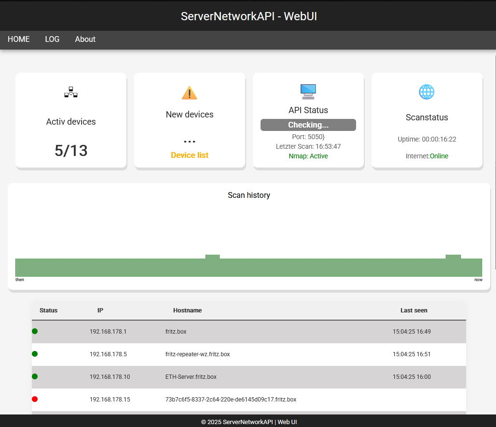

# ServerNetworkAPI (v0.2.7c)

A minimalistic Web API with a CLI and WebUI interface, that scans your local IPv4 network and provides information like IP, OS, and open ports of all reachable devices.

---

## Preview

### Terminal Output (Linux)

### Web Output (Raw JSON)

### Web Output (HTML/JS Frontend)

### Discord Webhook (Notifications)

---

## How It Works

The app continuously scans your local network (e.g. `192.168.x.x`) via ARP ping to find active devices.  
For each active IP, it performs (optional) detailed scans via `nmap` to retrieve:

- Open ports & services
- OS fingerprint (basic)
- Hostname

Devices are tracked persistently – even offline devices remain in the list (marked as offline).  
If the last octet of a device IP exceeds a defined threshold, it's flagged as *non-DHCP* (e.g. static/manual).

---

[Overview](docs/ReadmeFiles/Overview.md)

[Installation](docs/ReadmeFiles/Installation.md)

[UpdateLog](docs/ReadmeFiles/UpdateLog.md)

[Disclaimer](docs/ReadmeFiles/Disclaimer.md)

## License

This project is licensed under the **GNU Affero General Public License v3.0 (AGPL-3.0)**.  
You may freely use, modify, and distribute it under the same license –  
as long as the resulting version remains open-source and AGPL-compatible.
