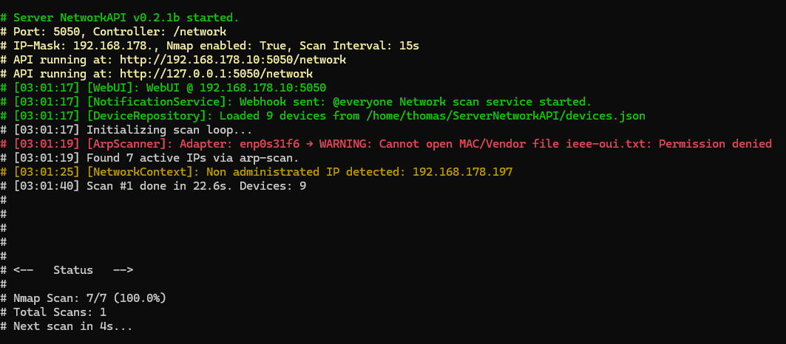

# 💻 ServerNetworkAPI (v0.1b)

A minimalistic Web API that scans your local IPv4 network and provides information like IP, OS, and open ports of all reachable devices.

Built with **.NET 9.0**

---

## 🚀 Features

- Automatic local network scan using `arp-scan`
- Optional detailed device scan via `nmap`
- Basic OS recognition
- CLI argument support
- RESTful Web API (JSON output)
- HTML frontend template (optional)
- Persistent device data between restarts
- Color-coded terminal output
- Offline detection & live status
- Logfile creation
- Statically assigned IP detection (highlighted)

---

## 🖥️ Preview

### Terminal Output (Linux)


### Web Output (Raw JSON)


### Web Output (HTML Frontend)


---

## ⚙️ How It Works

The app continuously scans your local network (e.g. `192.168.x.x`) via ARP ping to find active devices.  
For each active IP, it performs (optional) detailed scans via `nmap` to retrieve:

- Open ports & services
- OS fingerprint (basic)
- Hostname

Devices are tracked persistently – even offline devices remain in the list (marked as offline).  
If the last octet of a device IP exceeds a defined threshold, it's flagged as *non-DHCP* (e.g. static/manual).

---

## 🔧 Requirements

- sudo or root privileges (for `arp-scan` and `nmap`)
- Linux x64 system
- [.NET 9.0 Runtime](https://dotnet.microsoft.com/en-us/download/dotnet/9.0) (only if building yourself)
- [`nmap`](https://nmap.org/) (optional but recommended)
- [`arp-scan`](https://linux.die.net/man/1/arp-scan) – must be installed (`sudo apt install arp-scan`)

---

## 🧪 How to Run

Download the [latest Linux build](https://github.com/DRgreenT/ServerNetworkAPI/blob/main/publish/linux.zip), then:

```bash
chmod +x ServerNetworkAPI
./ServerNetworkAPI
```
To run the program [nmap] and [arp-scan]is mandator, you can check with ```nmap --version``` in case its not installed than:<br>
sudo apt install nmap arp-scan     # Debian, Ubuntu, Raspberry Pi OS<br>
sudo pacman -S nmap arp-scan       # Arch Linux, Manjaro<br>
sudo dnf install nmap arp-scan     # Fedora<br>
sudo zypper install nmap arp-scan  # openSUSE<br>

To access the API from another device in your local network, make sure port (default) 5050 is open:<br>
```sudo ufw allow 5050```                                                              # Debian/Ubuntu (with UFW enabled)<br>
```sudo firewall-cmd --add-port=5050/tcp --permanent && sudo firewall-cmd --reload```  # Fedora/CentOS<br>
```sudo iptables -A INPUT -p tcp --dport 5050 -j ACCEPT```                             # Fallback (legacy systems)<br>

If you want to use the included [Downlaod Html template](https://github.com/DRgreenT/ServerNetworkAPI/blob/main/publish/zip/frontEndTemplate.zip) for visualizing the API data,
please make sure to adjust the IP address to match the device where your API is hosted in the following line (line 1) in the `./JS/script.js` file:

```var localHostIP = "192.168.178.10";```


### Available CLI parameters:
       
`--help/-help`           Shows this help message<br>
`--t {int}`              Delay between loops in seconds (default: 5 min: 1 max:3600)<br>
`--p {int}`              Web API port (default: 5050)<br>
`--c {string}`           Controller name (default: 'network')<br>
`--nmap`                 Set nmap scan active (default ping only)<br>
`--fip {string}`         Default fallback IP mask 192.168.178.<br> 

---

## Build (Net9.0 SDK required)

```git clone https://github.com/DRgreenT/ServerNetworkAPI.git```<br>
```cd ServerNetworkAPI```<br>
```dotnet publish -c Release -r linux-x64 --self-contained true -p:PublishSingleFile=true```<br>

---

## Disclaimer

This project is intended for educational and local testing purposes only.
Using tools like nmap or arp-scan on networks outside your own may violate local laws, ISP policies, or institutional rules.

Please use this software responsibly and only on networks you are authorized to scan.

The developer assumes no responsibility for:

    Any damage, data loss, or service disruptions caused by the use or misuse of this software

    Legal consequences arising from scanning unauthorized networks

    Any malfunction due to system incompatibilities or environmental factors

By using this software, you agree to use it at your own risk.for any damage, malfunctions, or legal consequences resulting from use of this software or parts of it.


